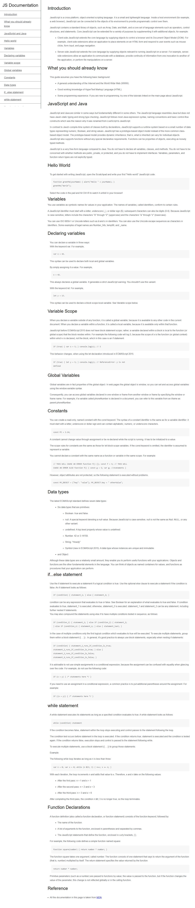

# JavaScript Technical Documentation Page

This is a static documentation page for JavaScript, providing information about the language's syntax, features, and usage. The website is built using HTML and CSS, with no backend functionality.

## Features

- Mobile-responsive for seamless viewing on any device
- Clear and organized information
- Easy navigation with a table of contents
- Code examples to illustrate concepts

## Technologies Used

- HTML5: Used to structure the website's content and layout.
- CSS3: Used to style the website's layout and design, including color schemes, typography, and animations.

## Usage

To view the website, simply visit the live site or download the project files and open the `index.html` file in your preferred web browser. The website can be easily customized and modified to fit your specific documentation needs.

## Contributing

Contributions to this project are welcome! Feel free to fork this repository and submit a pull request with your changes.

## Credits

This project was built by [Francisco Silva](https://github.com/Burntroll).

## License

This project is licensed under the [MIT License](https://opensource.org/licenses/MIT).

## Results

